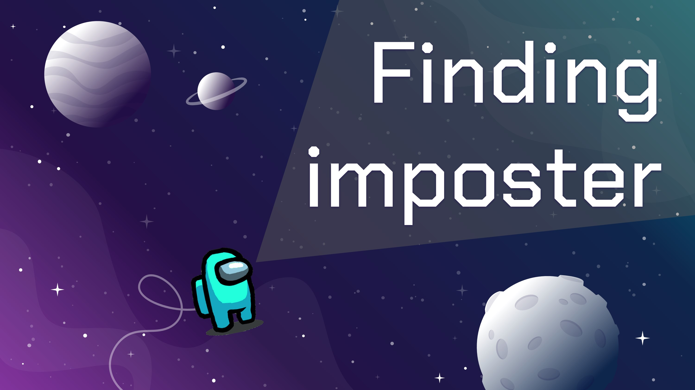
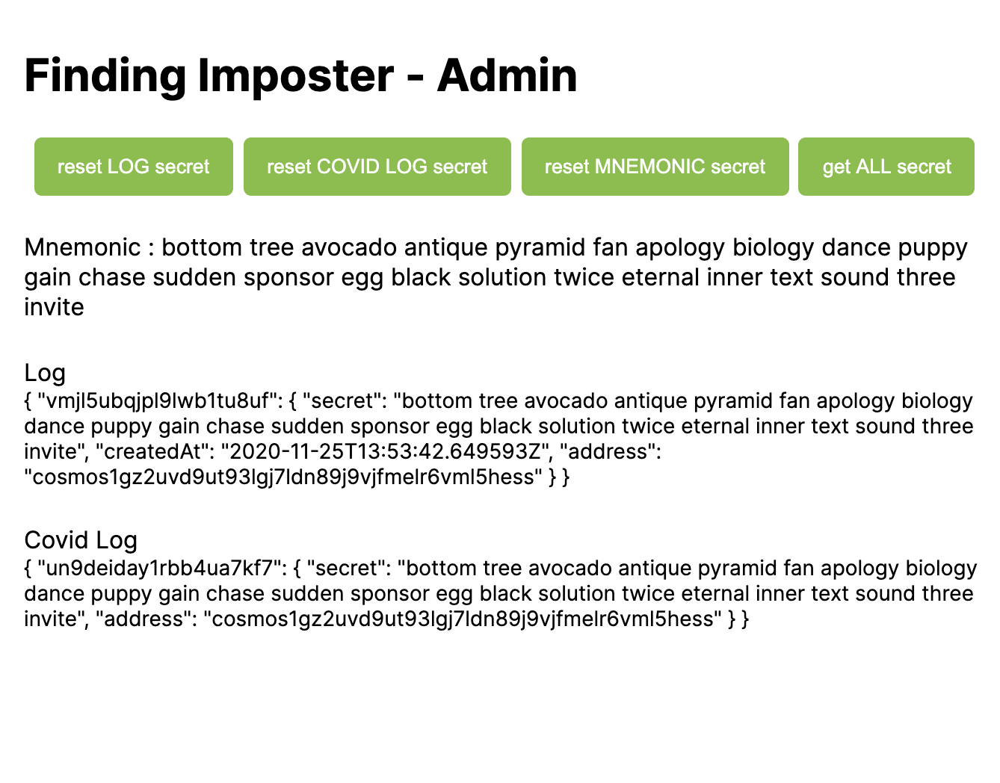
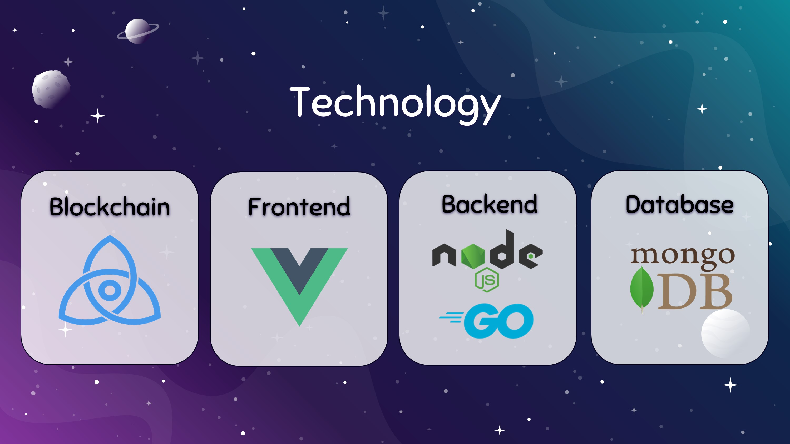
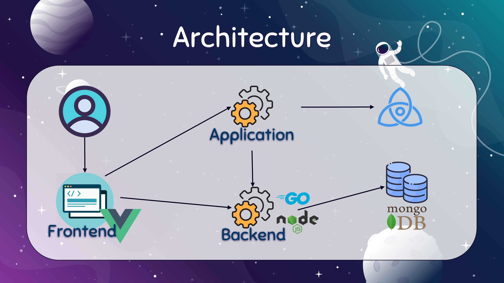

[](https://gitpod.io/#https://github.com/chantmk/Finding-imposter)
# Finding-imposter
 class's project of 2110595 ADV TOP COMP V (Blockchain) 



The project is the COVID-19 pandemic logging system using blockchain to collect information of people travelling through various building which registered to our system.

The name "Finding-imposter" of the project is from [AmongUS](http://www.innersloth.com/gameAmongUs.php). The objective of game is to find "who is the imposter" as well as our project "who is infected".

The system include
1. Check-in and Check-out from the building.
2. Assign and validation who is affected by COVID-19 by trusted third party verified Doctors.
3. Calculate and report who has to isolate as we call it "Quarantine".


 This project using 
 - [Tendermint](https://tendermint.com/) as Byzentine Fault tolerant consensus protocol
 - [Cosmos SDK](https://docs.cosmos.network/)  and [Starport](https://github.com/tendermint/starport) for development

---
## How to run our project?
###  **Option 1: gitpod**
> 1. Click [](https://gitpod.io/#https://github.com/chantmk/Finding-imposter) tag at the top of this [README.md](README.md) to launch gitpod workspace and start starport application via gitpod or click the button below. The system will automatically install starport version 0.0.10 and serve for you.
> 2. Click Open Ports tab at the console.
> 3. Open Browser of port 8080 and add (link) to the end of link to access our frontend.
> 4. Enjoy!

[](https://gitpod.io/#https://github.com/<your-org>/<your-project>)


### **Option 2: Deployment**

> We provided docker file but not recommend as we have never tested it yet.

### **Option 3: Up to you**
> Since we using [Starport version 0.0.10](https://github.com/tendermint/starport) all you have to do is install [nodejs >= 12.19.0](https://nodejs.org/en/),[ Golang >= 1.14](https://golang.org/) and [Starport](https://github.com/tendermint/starport) via below commands.

```
apt-get install nodejs
apt-get install golang
npm install -g @tendermint/starport@0.0.10

// Serve starport
starport serve
```

## Link to each page
For User : http://localhost:8080/main

For Doctor : http://localhost:8080/

For Admin : http://localhost:8080/admin
> This page will show the local storage using in this project and have reset button.
> 
>Just for debugging
>
> 

---
## Project architecture
|Topic|Framework|Description|
|-|-|-|
|[Front end](doc/Frontend.md)| [Vue.JS](https://vuejs.org/) | User interface 
|[Back end](doc/Backend.md)| [Golang](https://golang.org/) | Application logic
|Database|[mongoDB](https://www.mongodb.com/)|Data mapping
|Blockchain| [Tendermint](https://tendermint.com/)| BFT consensus protocol

---

> Please note that Backend will terminate by this year



---

# Members
1. [Jirapat Khupanit 6030087221](https://github.com/focusjk)
2. [Thammakorn Kobkuachaiyapong 6030272021](https://github.com/chantmk)
3. [Budsakorn Khosagrid 6031035821](https://github.com/mingokl02135)

[...Improvement...](doc/Improvement.md)
