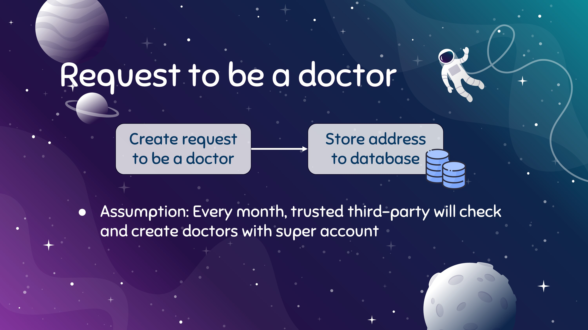

# Backend of Finding-imposter

Backend developed with golang pre-created with Starport script from tendermint.
For all timestamp included in each transaction are created by Backend via Time module.


[...In case you looking for list of all command and api](doc/Command.md)

Our Backend consist of 4 types
1. [Log](#log)
2. [Quarantine](#quarantine)
3. [Covid](#covid)
4. [Doctor](#doctor)

## Log
This type represent Check in and Check out log which stored address of the generated user, place and timestamp in order to track where the user is and compare if they are at risk.

```
Log {
    Creator sdk.AccAddress,
	ID string,
    LogID string,
    PlaceID string,
    CreatedAt time.Time,
    Action string,
}
```
> The action is `CHECKIN` or `CHECKOUT`
### Command and API for Log
|Command | API | Argument/Body | Description|
|-|-|-|-|
|create-log| POST /log| logID, placeID, action| create log tx with required information
|list-log| GET /log|-| list all log
|list-spec-log| POST /log/list| address(s)| list log created with specify address|
---

## Quarantine
Quarantine type represent quarantine block which specify who has to isolate from when to when.
This block is auto-generated after Covid block reported and will use start time as when the transaction was created. For end time we will just add start time with 14 days.

```
Quarantine {
    Creator sdk.AccAddress,
	ID string,
    UserAddress sdk.AccAddress,
    StartAt time.Time,
    EndAt time.Time,
}
```

### Command and API for Quarantine
|Command | API | Argument/Body | Description|
|-|-|-|-|
|create-quarantine| POST /quarantine| address | create quarantine tx with required information
|list-quarantine| GET /quarantine|-| list all quarantine
|list-spec-quarantine| POST /quarantine/list| address(s)| list quarantine that specify address need to be isolate|
---
## Covid
Covid type represent who affect with COVID-19, will be created after user press the report button. Then the address(s) specified will use for query log block and find who has to isolate via create quarantine transaction.

```
Covid {
	Creator sdk.AccAddress,
	ID string,
    CovidID string,
    CreatedAt time.Time,
    Status string,
    PubKey []string,
}
```
> The status is `PENDING`, `APPROVED` or `REJECTED`
>
> `APPROVED` and `REJECTED` can be created with verified doctor only. The doctors will create this status when they commit approve or reject the pending covid transaction.

### Command and API for Covid
|Command | API | Argument/Body | Description|
|-|-|-|-|
|create-covid| POST /covid| covidID, status, address(s) | create covid tx with required information and query with provided address(s)
|list-covid| GET /covid|-| list all covid
|list-spec-covid| POST /covid/list| address(s)| list covid that specify address affected by COVID-19|
|list-pending-covid| POST /covid/pending |-| list all covid transaction with status PENDING
---
## Doctor
Doctor type represent who is verified doctor.

```
Doctor {
	Creator sdk.AccAddress
	ID string
    Address string
    IsDoctor string
}
```
> isDoctor is `True` or `False` True for verified and False for unverified.
### Command and API for Doctor
|Command | API | Argument/Body | Description|
|-|-|-|-|
|create-doctor| POST /doctor| address, isDoctor | create doctor tx with required information
|list-doctor| GET /doctor|-| list all doctor
---

>User can request to be a doctor by click request in the doctor page.
> 
