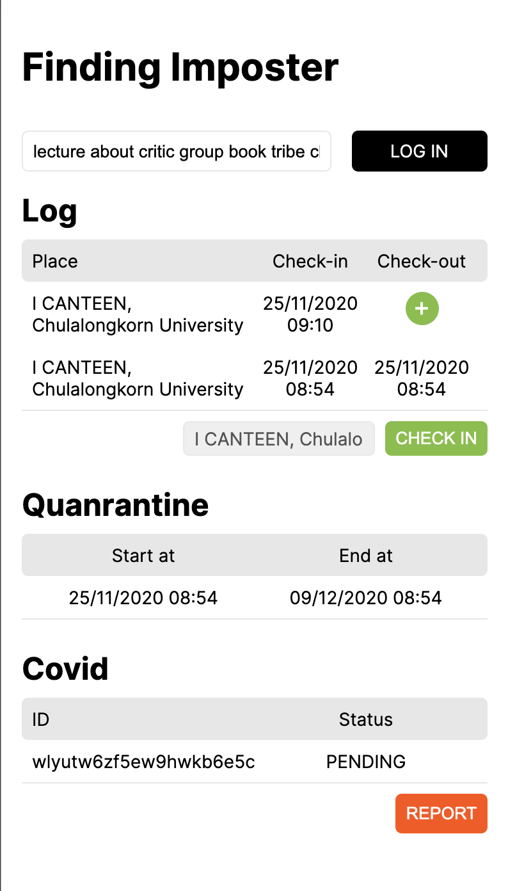
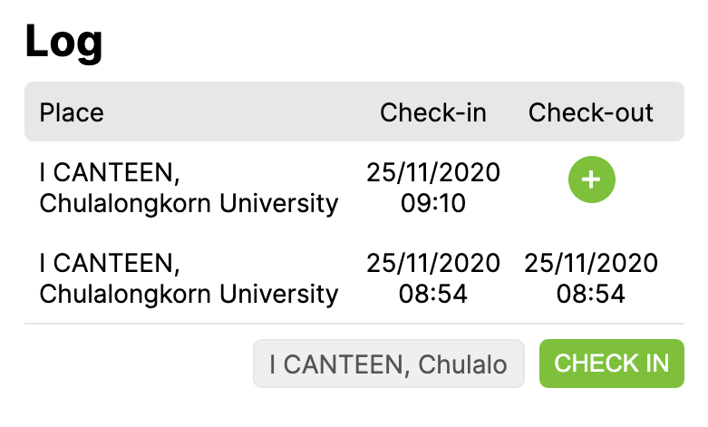
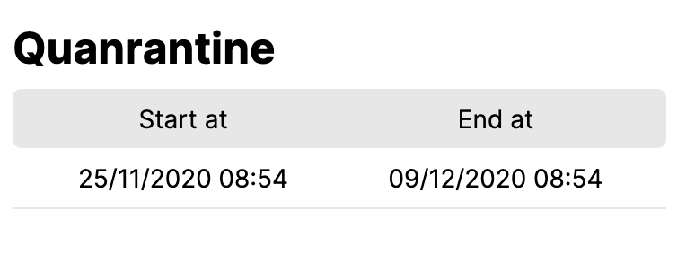
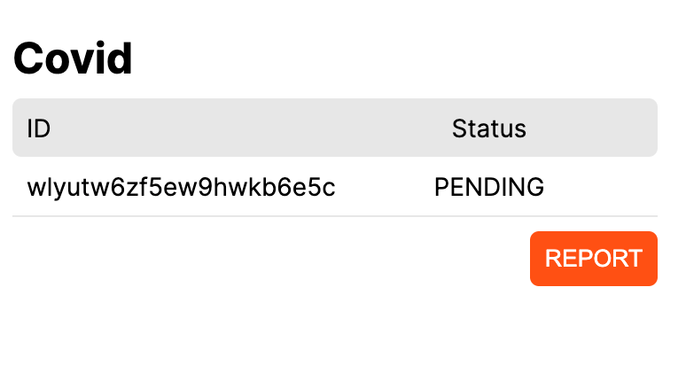
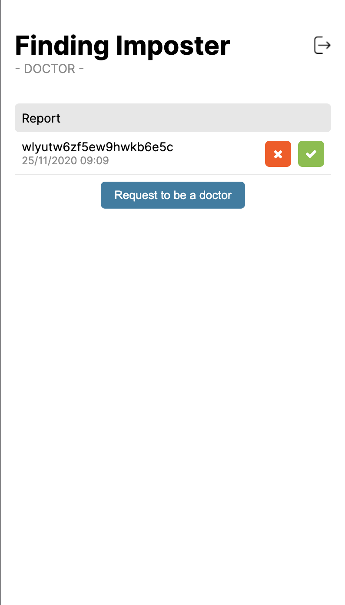
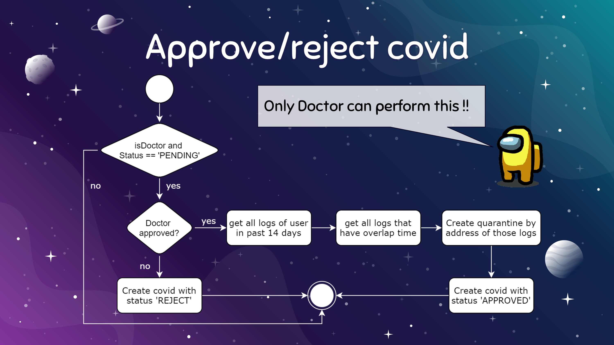

# Frontend of Finding-imposter

Our frontend using Vue.JS created with starport from tendermint there is 2 main pages, user page and doctor page.

## Table of contents
1. [Normal user page](#user-page)
    1. [Log list and check-in/out section](#log-section)
    2. [Quarantine list section](#quarantine-section)
    3. [Covid list and report section](#covid-section)
2. [Doctor page](#doctor-whole-page)
    1. [Doctor login](#doctor-login-page)
    2. [Covid list and approve/reject section](#approval-and-reject)

---

## User page
This page is the user's page. User's device will open this page after scan QR code. This page contain every function of user as the list below.
* Check in and Check out.
* Quarantine.
* Covid.

### Log section
In this section user could see their check-in and check-out log and could press check in button to commit check in. The location will be assigned automatically 

1. For checking-in click http://localhost:8080/main?id=5faf9e8c6e770822234c3dde 

> Id is represented the place, we don't allow user to input by themselves but could access via scan our pre-generated QR code
>
>*You need to login with mnemonic before checkin* 
> 
>
>Find out more places from https://web-swacp72spq-as.a.run.app/place

2. After user press check in button the application will 
    1. Automatically create log transaction with status CHECKIN, timestamp and other required information.
    2. store account into local storage

3. After user press check out button the application will
    1. Automatically create log transaction with account from local storage, status CHECKOUT, timestamp and other required information.

[check-in flow chart](images/Slide14.JPG)

[check-out flow chart](images/Slide16.JPG)
### Quarantine section
In this section our web application will query with account in the local storage and show all quarantine needed for the user.

### Covid section

Same as log and quarantine, this section will list all covid related transaction and provide the self-report covid button.

After user press the self-report button the application will
1. Generate new account.
2. Create covid transaction with timestamp, status PENDING and address from user local storage.
3. save account to local storage.

[report flow chart](images/Slide20.JPG)
## Doctor page

This page is for Doctor who verified by trusted third party to see is it any covid pending to approve or reject.

> In this state doctor must create the doctor transaction to verify he/she is a doctor. If there is no doctor transaction relate to his/her account he/she will not see as a doctor.

### Doctor login page

This page is the first page of the doctor. The verfied doctor must provide nmemonic password in order to access doctor function.

### Approval and Reject

This section consist of two parts, one for list pending covid transaction and one for approve/reject each transaction.

[Table of contents](#frontend-of-finding-imposter)
